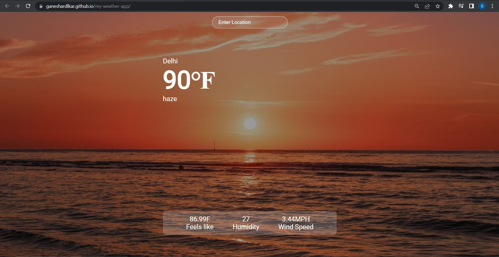
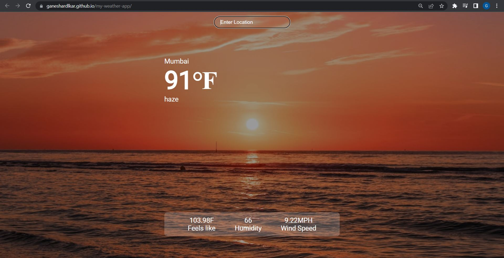

# Weather App

## Overview of weather app
This project is created using ReactJS library.
The purpose of this project was to learn and get familiar with ReactJS and Hooks in ReactJS.

Live Demo : [https://ganeshardlkar.github.io/my-weather-app/]

## API used
Open weather API [https://api.openweathermap.org]

## Fonts
Google Fonts [https://fonts.googleapis.com/css2?family=Roboto&display=swap]

## Libraries used
axios
react-scripts
